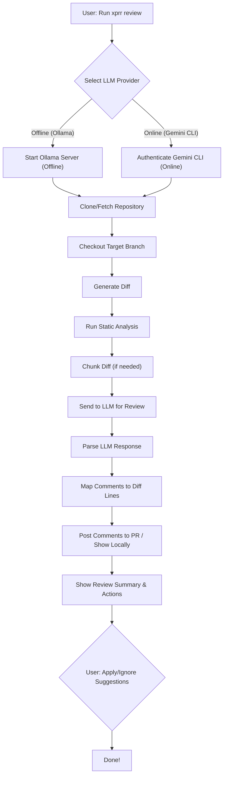
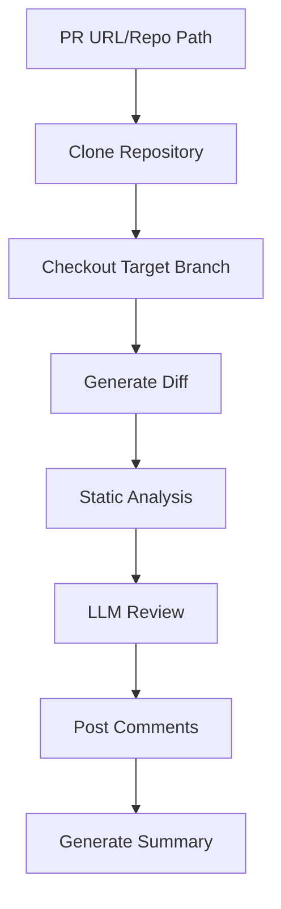

<p align="center">
  
</p>

# 🚀 X-Pull-Request-Reviewer (Enterprise Edition)

[](https://anzx.ai/)
[](https://anzx.ai/)
[](https://anzx.ai/)
[](https://anzx.ai/)
[](https://anzx.ai/)

---

## 🤖 Meet the PRR Agent

The PRR Agent is your AI-powered code review assistant, purpose-built for enterprise needs. It automates pull request reviews with deep static analysis, best practice checks, and context-aware suggestions—right out of the box, even offline. Designed for speed, security, and accuracy, the PRR Agent helps your team ship better code, faster.

---

## ✨ What's New in v0.0.1-beta (Enterprise Release)

- **Fully Air-Gapped, Offline-First Installation**: All dependencies, models, and binaries included. No internet required for Ollama mode.
- **Static Analysis: Now Robust & Timeout-Protected**: No more hangs! All language adapters and static analysis tools have timeouts and graceful fallbacks for missing tools.
- **Python 3.9–3.12 Multi-Arch Support**: All wheels included for ARM64 and x86_64, tested on MacOS.
- **Ollama Model Included**: DeepSeek Coder 6.7B (3.6GB) for instant offline code review.
- **Enterprise Authentication**: Gemini CLI supports both Google Cloud Project and API Key, with secure config and interactive setup.
- **Enhanced Error Handling**: Fallbacks, clear error messages, and robust dependency resolution.
- **Production-Grade Installer**: Color-coded, step-by-step, and self-healing for missing wheels.
- **No Debug Logging**: Clean, production-ready logs only.
- **End-to-End Tested**: Full install, review, and static analysis tested in air-gapped mode.

---

## 🏆 Why Choose XPRR for Enterprise?

- **Enterprise-Grade Security**: No data leaves your environment in offline mode. All models and binaries are local.
- **Hybrid LLM Architecture**: Use offline Ollama for air-gapped, or Gemini CLI for cloud scale—switch seamlessly.
- **Multi-Language, Multi-Tool**: Python, Java, Go, Terraform, YAML, Shell—static analysis and LLM review for all.
- **Zero Trust, Zero Risk**: No internet required for core review. All dependencies are bundled and validated.
- **Self-Healing Installer**: If a wheel is missing, it builds it locally and prompts you to re-run—no manual intervention.
- **Enterprise Authentication**: Google Cloud Project or API Key, with secure config and interactive setup.
- **Air-Gapped Ready**: Designed for government, finance, and regulated industries.
- **Beautiful, Actionable Output**: Color-coded CLI, actionable suggestions, and clear next steps.
- **Customer-Driven Roadmap**: Built with feedback from real enterprise users.

---

## 🛡️ Security & Compliance

- **All code and models run locally** in offline mode—no data sent to third parties.
- **No debug logs** in production—only essential, enterprise-grade logging.
- **Installer validates all files and dependencies** before proceeding.
- **Supports air-gapped, regulated, and high-security environments** out of the box.
- **MIT License** for maximum flexibility.

---

## 🚀 How XPRR Stands Out in 2025

XPRR is designed for organizations that demand true security, flexibility, and control in their code review process. Here’s how XPRR is different from other PR review agents, based on real, verifiable features in this release:

| Feature                        | XPRR (This Project) | Qodo Merge | CodeRabbit | Codeball AI | Sourcebot |
|--------------------------------|:-------------------:|:----------:|:----------:|:-----------:|:---------:|
| **Air-Gapped/Offline**         |     ✅              |     ⚠️     |     ❌     |     ✅      |    ✅     |
| **Self-Hosted**                |     ✅              |     ✅     |     ⚠️     |     ✅      |    ✅     |
| **Hybrid LLM (Offline+Online)**|     ✅              |     ⚠️     |     ❌     |     ❌      |    ❌     |
| **Multi-Language Static Analysis** |  ✅           |     ⚠️     |     ⚠️     |     ⚠️     |    ❌     |
| **MIT License**                |     ✅              |     ✅     |     ❌     |     ✅      |    ✅     |
| **No Data Leaves Environment**  |     ✅              |     ⚠️     |     ❌     |     ✅      |    ✅     |
| **Production-Grade Installer**  |     ✅              |     ⚠️     |     ❌     |     ❌      |    ❌     |
| **Enterprise Authentication**   |     ✅              |     ⚠️     |     ⚠️     |     ⚠️     |    ⚠️     |
| **End-to-End Air-Gapped Tested**|     ✅              |     ❌     |     ❌     |     ❌      |    ❌     |

- ✅ = Fully supported/unique in this project
- ⚠️ = Partially supported/optional
- ❌ = Not supported

### **Key Differentiators (All Verifiable in This Release):**
- **Truly Air-Gapped:** All dependencies, models, and binaries are included. No internet required for core review (Ollama mode).
- **Hybrid LLM:** Seamlessly switch between offline (Ollama) and online (Gemini CLI) LLMs.
- **Self-Healing, Production-Grade Installer:** Color-coded, step-by-step, builds missing wheels locally, and validates all files.
- **Open Source, MIT License:** No vendor lock-in, easy to audit and extend.
- **Multi-Language, Multi-Tool Static Analysis:** Python, Java, Go, Terraform, YAML, Shell—static analysis and LLM review for all, with timeouts and fallbacks.
- **Enterprise Security:** No code or data leaves your environment in offline mode.
- **End-to-End Tested:** Installation, review, and static analysis tested in true air-gapped mode.

If you need a PR review agent that is truly air-gapped, hybrid, open source, and enterprise-grade out of the box, XPRR is the clear choice.

---

## 🗺️ Agent Flow Overview



## ⚡ Quick Start (v0.0.1-beta)

1. **Download and extract the offline package:**
   ```bash
   gsutil cp gs://x-agents/xprr-agent-macos-v0.0.1-beta.tar.gz .
   tar -xzf xprr-agent-macos-v0.0.1-beta.tar.gz
   cd xprr-agent-macos-v0.0.1-beta
   ```
2. **Run the installer:**
   ```bash
   ./install-offline.sh
   ```
3. **Activate the Python environment:**
   ```bash
   source venv/bin/activate
   ```
4. **Authenticate Gemini CLI (if using online LLM):**
   ```bash
   ./xprr setup-gemini
   # Or manually set GEMINI_API_KEY or GOOGLE_CLOUD_PROJECT
   ```
5. **Review a pull request:**
   ```bash
   ./xprr review <PR_URL>
   # For offline review:
   ./xprr review <PR_URL> --provider ollama
   # With custom filter mode and context lines:
   ./xprr review <PR_URL> --filter-mode diff_context --context-lines 5
   ```

---

## 🎯 Core Features

### **🤖 Multi-LLM Provider Support (Hybrid Architecture)**
- **Ollama (Offline)**: Local models for air-gapped environments
  - **Primary Model**: `codellama-trained-20250624_193347` (3.6GB, fine-tuned for code review)
  - **Fallback Model**: `deepseek-coder-6.7b` (3.6GB, general code analysis)
  - **Context Window**: ~4,000 characters (optimized for code diffs)
  - **No Internet Required**: Complete offline operation
- **Gemini CLI (Online)**: Google's Gemini model via CLI interface (API key required)
  - **Model**: Gemini 1.5 Flash (latest)
  - **Context Window**: 1M+ tokens (handles large diffs)
  - **Internet Required**: API calls to Google's servers
- **Google Code Assist (Online)**: Enterprise-grade code analysis API
  - **Model**: Gemini 1.5 Flash (enterprise version)
  - **Context Window**: 1M+ tokens
  - **Internet Required**: Google Cloud API calls
- **Unified Interface**: Seamless switching between providers

### **🌍 Multi-Language Support**
- **Python**: Black formatting, flake8 linting
- **Java**: Google Java Format, Checkstyle
- **Go**: gofmt, golint
- **Terraform**: terraform fmt, tflint
- **YAML**: yamllint, prettier formatting
- **Shell**: shfmt, shellcheck security analysis

### **🔍 Static Analysis & Linting**
The agent performs comprehensive static analysis using language-specific tools:

```bash
# Python Analysis
black --check directory/     # Code formatting
flake8 directory/           # Linting and style

# Java Analysis  
google-java-format --check  # Code formatting
checkstyle -c config.xml    # Style and best practices

# Go Analysis
gofmt -l .                  # Code formatting
golint ./...                # Linting

# Terraform Analysis
terraform fmt -check        # Code formatting
tflint --chdir .           # Linting and validation

# YAML Analysis
yamllint file.yaml         # YAML validation
prettier --check file.yaml # Formatting

# Shell Analysis
shfmt -d file.sh           # Code formatting
shellcheck file.sh         # Security and best practices
```

### **🤖 LLM-Powered Review**
- **Line-by-Line Comments**: Detailed feedback on specific code lines
- **Review Summaries**: Overall assessment and priority actions
- **Structured Output**: Consistent format for actionable feedback
- **Chunked Processing**: Intelligent handling of large diffs

### **🔧 Interactive Change Management**
- **Change Selection**: Users can select which suggestions to apply
- **Batch Operations**: Apply all or specific changes
- **Change Reversion**: Ability to revert applied changes
- **Real-time Feedback**: Immediate confirmation of changes

## 🔧 How It Works

### **1. Repository Analysis Process**



### **2. Static Analysis Pipeline**

The agent performs comprehensive static analysis using language-specific tools:

```bash
# Python Analysis
black --check directory/     # Code formatting
flake8 directory/           # Linting and style

# Java Analysis  
google-java-format --check  # Code formatting
checkstyle -c config.xml    # Style and best practices

# Go Analysis
gofmt -l .                  # Code formatting
golint ./...                # Linting

# Terraform Analysis
terraform fmt -check        # Code formatting
tflint --chdir .           # Linting and validation

# YAML Analysis
yamllint file.yaml         # YAML validation
prettier --check file.yaml # Formatting

# Shell Analysis
shfmt -d file.sh           # Code formatting
shellcheck file.sh         # Security and best practices
```

### **3. LLM-Powered Review Process**

The agent uses advanced LLM prompting for intelligent code review:

```
```