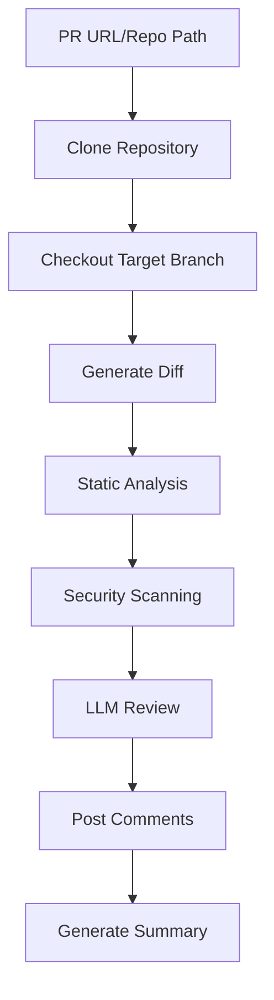

# 🚀 X-Pull-Request-Reviewer (Enterprise Edition)

**Enterprise-Grade, Offline, LLM-Powered Code Review Agent**

Secure | Air-Gapped | Multi-Language | Plug-and-Play

---

## ✨ Overview

X-Pull-Request-Reviewer (XPRR) is a production-ready, enterprise-grade code review agent that automatically analyzes pull requests and provides actionable feedback. It combines traditional static analysis with modern AI-powered review capabilities, making it suitable for both development teams and compliance-focused organizations.

## 🎯 Core Features

### **🤖 Multi-LLM Provider Support**
- **Ollama (Offline)**: Local models for air-gapped environments
- **Gemini CLI**: Google's Gemini model via CLI interface (API key required)
- **Google Code Assist**: Enterprise-grade code analysis API
- **Unified Interface**: Seamless switching between providers

### **🌍 Multi-Language Support**
- **Python**: Black formatting, flake8 linting, docstring checking
- **Java**: Google Java Format, Checkstyle, Javadoc validation
- **Go**: gofmt, golint, package documentation
- **Terraform**: terraform fmt, tflint, resource documentation
- **YAML**: yamllint, prettier formatting
- **Shell**: shfmt, shellcheck security analysis

### **🔒 Security Analysis**
- **Hardcoded Credentials**: Detects passwords, API keys in code
- **SQL Injection**: Identifies vulnerable database queries
- **XSS Vulnerabilities**: Cross-site scripting detection
- **Command Injection**: Dangerous system calls (eval, os.system, etc.)
- **Input Validation**: Missing validation checks
- **Language-Specific Patterns**: 
  - Python: `eval()`, `os.system()`, hardcoded passwords
  - Terraform: `plain_text`, `sensitive = false`
  - Shell: `curl | sh`, `sudo` usage
  - Go: `exec.Command` usage
  - Java: `Runtime.getRuntime().exec`

### **📋 Compliance Checks**
- **License Headers**: Missing license file detection
- **Copyright Issues**: Copyright compliance validation
- **Resource Naming**: Terraform naming convention violations
- **Forbidden Packages**: Java `sun.*` packages, Python `pickle`
- **Export Control**: Regulatory compliance checking

### **🏗️ Best Practices Analysis**
- **Documentation Quality**: Missing docstrings, comments, README
- **Code Formatting**: Language-specific style violations
- **Magic Numbers**: Unnamed constants in code
- **Variable Documentation**: Missing descriptions and comments
- **Architecture Patterns**: Code structure and organization

### **📦 Dependency Analysis**
- **Pre-1.0 Versions**: Unstable dependency detection
- **Python**: `requirements.txt` and `pyproject.toml` analysis
- **Go**: `go.mod` version checking
- **Java**: `pom.xml` dependency validation
- **Terraform**: Provider version stability

### **🧪 Test Coverage Analysis**
- **Python**: pytest coverage reporting
- **Go**: `go test -cover` integration
- **Java**: JaCoCo report detection
- **Terraform**: Terratest file identification

## 🔧 How It Works

### **1. Repository Analysis Process**



### **2. Static Analysis Pipeline**

The agent performs comprehensive static analysis using language-specific tools:

```bash
# Python Analysis
black --check directory/     # Code formatting
flake8 directory/           # Linting and style

# Java Analysis  
google-java-format --check  # Code formatting
checkstyle -c config.xml    # Style and best practices

# Go Analysis
gofmt -l .                  # Code formatting
golint ./...                # Linting

# Terraform Analysis
terraform fmt -check        # Code formatting
tflint --chdir .           # Linting and validation

# YAML Analysis
yamllint file.yaml         # YAML validation
prettier --check file.yaml # Formatting

# Shell Analysis
shfmt -d file.sh           # Code formatting
shellcheck file.sh         # Security and best practices
```

### **3. LLM-Powered Review Process**

The agent uses advanced LLM prompting for intelligent code review:

```python
# Structured prompt for consistent reviews
structured_prompt = f"""
You are an expert security code reviewer. Analyze the following code changes and provide specific, actionable feedback.

REQUIRED OUTPUT FORMAT:
LINE <line_number> COMMENT: <specific issue and how to fix it>
SUMMARY: <overall assessment and priority actions>

RULES:
1. For each security issue, vulnerability, or best practice violation, use LINE <number> COMMENT: format
2. Include the actual line number from the diff where the issue occurs
3. Provide specific, actionable advice on how to fix each issue
4. Focus on security vulnerabilities, compliance issues, and best practices
5. Be specific about what's wrong and how to fix it

DIFF TO REVIEW:
{diff}

STATIC ANALYSIS:
{static_analysis_results}
"""
```

### **4. Chunked Processing for Large Diffs**

For large pull requests, the agent intelligently chunks the diff:

```python
# Terraform: Chunk by resource blocks
if language.lower() == "terraform":
    resource_blocks = re.split(r'\nresource\s+"', diff)
    # Process each resource block separately

# Other languages: Chunk by file and hunk
else:
    chunked = chunk_diff_by_file_and_hunk(diff, max_chunk_chars=2000)
    # Process each chunk with progress tracking
```

### **5. Interactive Change Management**

Users can interactively apply suggested changes:

```bash
# Agent displays actionable suggestions
📝 ACTIONABLE CHANGES (3):
  [1] src/auth.py:15
      Reason: Hardcoded password detected
      Current: password = "secret123"
  
  [2] src/database.py:23
      Reason: SQL injection vulnerability
      Current: query = f"SELECT * FROM users WHERE id = {user_id}"

# User can select which changes to apply
Enter your choice: 1,3  # Apply changes 1 and 3
```

## 🔑 Authentication & Security

### **Gemini CLI Authentication**

The agent uses **API key authentication** (not Google account login):

```bash
# Setup process
./xprr setup

# Agent prompts for API key
🔑 Gemini CLI Setup
==================================================
To use Gemini CLI for code reviews, you need a Gemini API key.
Get your API key from: https://makersuite.google.com/app/apikey

Enter your Gemini API key: [hidden input]
```

**Credential Storage:**
- **System Keyring**: Most secure storage (macOS Keychain, Windows Credential Manager)
- **Local File**: `~/.xprr/credentials.json`
- **Environment Variables**: `GEMINI_API_KEY`

### **Google Code Assist Authentication**

```bash
# Requires Google Cloud service account
export GOOGLE_APPLICATION_CREDENTIALS="path/to/service-account.json"
```

### **Ollama (No Authentication Required)**

```bash
# Local models - no internet or authentication needed
./xprr review <PR_URL> --provider ollama
```

## 🚀 Installation & Setup

### **Prerequisites**

- **Python 3.8+**
- **Node.js & npm** (for Gemini CLI)
- **Git** (recommended)

### **Quick Installation**

```bash
# Clone the repository
git clone <repository-url>
cd x-pull-request-reviewer

# Run setup script
./setup.sh
```

The setup script automatically:
- ✅ Installs Python dependencies
- ✅ Installs Gemini CLI (if Node.js available)
- ✅ Creates necessary directories
- ✅ Sets up configuration files
- ✅ Prompts for API keys
- ✅ Makes the `xprr` command executable

### **Manual Setup**

```bash
# Install Python dependencies
pip install -r requirements.txt

# Install package globally
pip install -e .

# Make executable
chmod +x xprr

# Setup credentials
./xprr setup
```

## 📋 Usage Examples

### **Basic Commands**

```bash
# Setup dependencies and credentials
./xprr setup

# Check agent status
./xprr status

# Review a pull request
./xprr review https://github.com/org/repo/pull/123

# Review with specific provider
./xprr review https://github.com/org/repo/pull/123 --provider gemini_cli

# Non-interactive mode (for CI/CD)
./xprr review https://github.com/org/repo/pull/123 --no-interactive

# Stop the agent
./xprr stop

# Check air-gap readiness
./xprr check-airgap
```

### **Advanced Usage**

```bash
# Review by PR number and repo slug
./xprr review --pr-number 123 --repo-slug org/repo

# Review with specific provider and non-interactive
./xprr review --pr-number 123 --repo-slug org/repo --provider gemini_cli --no-interactive

# Review local repository
./xprr review --repo-path /path/to/local/repo --branch feature-branch
```

### **CI/CD Integration**

```bash
# Non-interactive mode for automation
./xprr review <PR_URL> --no-interactive --provider gemini_cli

# With GitHub token for posting comments
export GITHUB_TOKEN="your-github-token"
./xprr review <PR_URL> --no-interactive
```

## 🏗️ Architecture

### **Directory Structure**

```
x-pull-request-reviewer/
├── src/                    # Source code
│   ├── agent/             # Core agent logic
│   │   ├── main.py        # Main review orchestration
│   │   ├── static_analysis.py  # Static analysis engine
│   │   ├── diff_utils.py  # Diff parsing and chunking
│   │   ├── git_utils.py   # Git operations
│   │   ├── change_manager.py  # Interactive change management
│   │   └── suggestion_parser.py  # LLM response parsing
│   ├── adapters/          # Language-specific adapters
│   │   ├── python_adapter.py    # Python tools (black, flake8)
│   │   ├── java_adapter.py      # Java tools (checkstyle, format)
│   │   ├── go_adapter.py        # Go tools (gofmt, golint)
│   │   ├── terraform_adapter.py # Terraform tools (fmt, tflint)
│   │   ├── yaml_adapter.py      # YAML tools (yamllint, prettier)
│   │   └── shell_adapter.py     # Shell tools (shfmt, shellcheck)
│   ├── llm/               # LLM provider integrations
│   │   ├── unified_client.py    # Unified LLM interface
│   │   ├── ollama_client.py     # Ollama integration
│   │   ├── gemini_cli_client.py # Gemini CLI integration
│   │   ├── google_code_assist_client.py  # Google Code Assist
│   │   ├── credential_manager.py # Secure credential storage
│   │   └── review_prompt.py     # LLM prompt engineering
│   ├── review/            # Review engines
│   │   ├── security.py    # Security vulnerability detection
│   │   ├── compliance.py  # Compliance checking
│   │   ├── best_practices.py  # Best practices analysis
│   │   ├── dependency.py  # Dependency analysis
│   │   ├── test_coverage.py  # Test coverage analysis
│   │   └── documentation.py  # Documentation checking
│   └── github/            # GitHub API client
│       └── pr_client.py   # PR comment posting
├── tests/                 # Test suite
├── config/                # Configuration files
├── bin/                   # Binary dependencies
├── packages/              # Python wheel packages
├── ollama_models/         # Ollama model files
├── logs/                  # Log files
├── xprr                   # Main CLI script
├── setup.sh               # Setup script
└── README.md              # This file
```

### **Core Components**

#### **1. Agent Main (`src/agent/main.py`)**
- Repository cloning and checkout
- Diff generation and parsing
- Static analysis orchestration
- LLM review coordination
- GitHub comment posting

#### **2. Static Analysis (`src/agent/static_analysis.py`)**
- Language detection
- Tool execution (black, flake8, etc.)
- Result aggregation
- Format/lint reporting

#### **3. LLM Integration (`src/llm/`)**
- Unified client interface
- Provider-specific implementations
- Prompt engineering
- Response parsing

#### **4. Review Engines (`src/review/`)**
- Security vulnerability detection
- Compliance checking
- Best practices analysis
- Dependency analysis
- Test coverage analysis

#### **5. Language Adapters (`src/adapters/`)**
- Language-specific tool execution
- Format checking
- Linting integration
- Error handling

## 🔍 Detailed Feature Analysis

### **Security Analysis Capabilities**

#### **Python Security Checks**
```python
# Detects dangerous patterns
if 'eval(' in lower_diff:
    issues.append('Use of eval() detected')
if 'os.system(' in lower_diff:
    issues.append('Use of os.system() detected')
if 'password' in lower_diff and '"' in lower_diff:
    issues.append('Possible hardcoded password')
```

#### **Terraform Security Checks**
```python
# Detects security misconfigurations
if 'plain_text' in lower_diff or 'sensitive = false' in lower_diff:
    issues.append('Possible sensitive value not protected')
```

#### **Shell Security Checks**
```python
# Detects dangerous shell patterns
if 'curl' in lower_diff and '| sh' in lower_diff:
    issues.append('Piping curl to shell detected')
if 'sudo' in lower_diff:
    issues.append('Use of sudo detected')
```

### **Dependency Analysis**

#### **Python Dependencies**
```python
# Analyzes requirements.txt and pyproject.toml
if ver.startswith('0.'):
    findings.append(f"Python package {pkg} is pre-1.0 (potentially unstable)")
```

#### **Go Dependencies**
```python
# Analyzes go.mod
if parts[2].startswith('v0.'):
    findings.append(f"Go module {parts[1]} is pre-1.0 (potentially unstable)")
```

#### **Java Dependencies**
```python
# Analyzes pom.xml
if version.startswith('0.'):
    findings.append(f"Java dependency {group}:{artifact} is pre-1.0")
```

### **Test Coverage Analysis**

#### **Python Coverage**
```python
# Runs pytest with coverage
result = subprocess.run(['pytest', '--cov', repo_dir], capture_output=True, text=True)
```

#### **Go Coverage**
```python
# Runs go test with coverage
result = subprocess.run(['go', 'test', '-cover', './...'], cwd=repo_dir)
```

#### **Java Coverage**
```python
# Detects JaCoCo reports
jacoco_report = os.path.join(repo_dir, 'target', 'site', 'jacoco', 'index.html')
```

## 🔧 Configuration

### **Default Configuration (`config/default.yaml`)**

```yaml
# LLM Provider Configuration
llm:
  default_provider: "ollama"  # Options: ollama, gemini_cli, google_code_assist
  timeout: 300  # Timeout in seconds for LLM requests

# Review Configuration
review:
  max_chunk_size: 4000  # Maximum characters per chunk
  enable_static_analysis: true
  enable_security_scanning: true
  enable_compliance_checking: true
  enable_best_practices: true
  enable_dependency_analysis: true
  enable_test_coverage: true
  enable_documentation_checking: true

# GitHub Configuration
github:
  api_timeout: 30
  max_retries: 3
  enable_line_comments: true
  enable_summary_comments: true

# Logging Configuration
logging:
  level: "INFO"  # DEBUG, INFO, WARNING, ERROR
  file: "logs/xprr.log"
  max_size: "10MB"
  backup_count: 5

# Security Configuration
security:
  enable_secret_scanning: true
  enable_hardcoded_credential_detection: true
  enable_sql_injection_detection: true
  enable_xss_detection: true

# Compliance Configuration
compliance:
  enable_license_checking: true
  enable_copyright_checking: true
  enable_export_control_checking: true
```

## 🚀 Deployment Options

### **Docker Deployment**

```bash
# Build the image
docker build -t xprr .

# Run the container
docker run -it --rm xprr review <PR_URL>
```

### **Air-Gapped Deployment**

1. **Download Dependencies:**
   ```bash
   # Download all wheel packages to packages/
   # Download Ollama models to ollama_models/
   ```

2. **Verify Readiness:**
   ```bash
   ./xprr check-airgap
   ```

3. **Offline Operation:**
   ```bash
   ./xprr review <PR_URL> --provider ollama
   ```

### **CI/CD Integration**

```yaml
# GitHub Actions example
- name: Run XPRR Review
  run: |
    ./xprr review ${{ github.event.pull_request.html_url }} \
      --no-interactive \
      --provider gemini_cli
  env:
    GEMINI_API_KEY: ${{ secrets.GEMINI_API_KEY }}
    GITHUB_TOKEN: ${{ secrets.GITHUB_TOKEN }}
```

## 📊 Performance Characteristics

- **Review Speed**: 30-60 seconds per PR (depending on size and provider)
- **Memory Usage**: 100-500MB (depending on model size)
- **CPU Usage**: Moderate during analysis
- **Network**: Minimal (except for API calls)
- **Large Diff Handling**: Automatic chunking for diffs >100KB

## 🔒 Security Features

- **No Code Execution**: XPRR only analyzes code, never executes it
- **Secure Credentials**: API keys stored in system keyring
- **Air-Gapped**: Can operate completely offline
- **Audit Trail**: All actions logged for compliance
- **Binary File Detection**: Automatically skips binary files
- **Input Validation**: Validates all inputs before processing

## 🧪 Testing

### **Running Tests**

```bash
# Run all tests
python -m pytest tests/ -v

# Run specific test
python -m pytest tests/test_adapters.py -v

# Run with coverage
python -m pytest tests/ --cov=src --cov-report=html
```

### **Test Coverage**

The test suite covers:
- Language adapters (Python, Java, Go, Terraform, YAML, Shell)
- LLM client integrations
- Review engines
- GitHub API client
- Core agent functionality

## 🤝 Contributing

### **Adding New Language Support**

1. **Create Adapter** in `src/adapters/`
   ```python
   # Example: rust_adapter.py
   def run_rustfmt_check(directory):
       """Run rustfmt --check and return output."""
       # Implementation
   ```

2. **Add Language Detection** in `src/agent/static_analysis.py`
   ```python
   LANG_EXT_MAP = {
       '.rs': 'rust',  # Add new language
   }
   ```

3. **Add Test Cases** in `tests/`
4. **Update Documentation**

### **Adding New LLM Provider**

1. **Create Client** in `src/llm/`
2. **Add to Unified Client** in `src/llm/unified_client.py`
3. **Add Credential Management** in `src/llm/credential_manager.py`
4. **Update CLI Options** in `xprr`

## 📄 License

This project is licensed under the MIT License - see the [LICENSE](LICENSE) file for details.

## 🙏 Acknowledgments

- **Developer**: Inder Chauhan
- **Organization**: https://anzx.ai/
- **Team**: X-agents Team

---

## 🆘 Support & Troubleshooting

### **Common Issues**

**Q: Gemini CLI installation fails**
A: Ensure Node.js and npm are installed. Run `node --version` and `npm --version` to verify.

**Q: API key not working**
A: Check that your API key is correct and has the necessary permissions.

**Q: Ollama model not found**
A: Run `./xprr setup` to install the required model.

**Q: Permission denied on xprr script**
A: Run `chmod +x xprr` to make it executable.

**Q: Large diff processing is slow**
A: The agent automatically chunks large diffs. For very large PRs, consider breaking them into smaller changes.

**Q: No comments posted to GitHub**
A: Ensure `GITHUB_TOKEN` environment variable is set and has appropriate permissions.

### **Getting Help**

- 📖 Check the documentation in `docs/`
- 🐛 Report issues with detailed logs
- 💬 Ask questions in the community

---

**Happy reviewing! 🚀** 