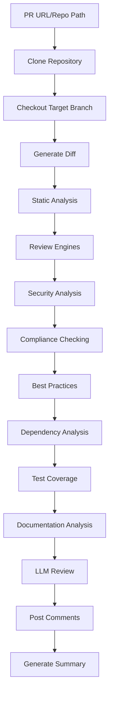

# 🚀 X-Pull-Request-Reviewer (Enterprise Edition)

**Enterprise-Grade, Hybrid LLM-Powered Code Review Agent**

Secure | Multi-Language | Hybrid (Offline + Online) | Plug-and-Play

---

## ✨ Overview

X-Pull-Request-Reviewer (XPRR) is a production-ready, enterprise-grade code review agent that automatically analyzes pull requests and provides actionable feedback. It combines traditional static analysis with comprehensive review engines (security, compliance, best practices, dependency, test coverage, documentation) and modern AI-powered review capabilities, offering both offline (Ollama) and online (Gemini CLI, Google Code Assist) LLM options. This hybrid approach makes it suitable for both air-gapped environments and cloud-connected development teams.

## 🎯 Core Features

### **🤖 Multi-LLM Provider Support (Hybrid Architecture)**
- **Ollama (Offline)**: Local models for air-gapped environments
  - **Primary Model**: `codellama-trained-20250624_193347` (3.6GB, fine-tuned for code review)
  - **Fallback Model**: `deepseek-coder-6.7b` (3.6GB, general code analysis)
  - **Context Window**: ~4,000 characters (optimized for code diffs)
  - **No Internet Required**: Complete offline operation
- **Gemini CLI (Online)**: Google's Gemini model via CLI interface (API key required)
  - **Model**: Gemini 1.5 Flash (latest)
  - **Context Window**: 1M+ tokens (handles large diffs)
  - **Internet Required**: API calls to Google's servers
- **Google Code Assist (Online)**: Enterprise-grade code analysis API
  - **Model**: Gemini 1.5 Flash (enterprise version)
  - **Context Window**: 1M+ tokens
  - **Internet Required**: Google Cloud API calls
- **Unified Interface**: Seamless switching between providers

### **🌍 Multi-Language Support**
- **Python**: Black formatting, flake8 linting
- **Java**: Google Java Format, Checkstyle
- **Go**: gofmt, golint
- **Terraform**: terraform fmt, tflint
- **YAML**: yamllint, prettier formatting
- **Shell**: shfmt, shellcheck security analysis

### **🔍 Static Analysis & Linting**
The agent performs comprehensive static analysis using language-specific tools:

```bash
# Python Analysis
black --check directory/     # Code formatting
flake8 directory/           # Linting and style

# Java Analysis  
google-java-format --check  # Code formatting
checkstyle -c config.xml    # Style and best practices

# Go Analysis
gofmt -l .                  # Code formatting
golint ./...                # Linting

# Terraform Analysis
terraform fmt -check        # Code formatting
tflint --chdir .           # Linting and validation

# YAML Analysis
yamllint file.yaml         # YAML validation
prettier --check file.yaml # Formatting

# Shell Analysis
shfmt -d file.sh           # Code formatting
shellcheck file.sh         # Security and best practices
```

### **🔍 Comprehensive Review Engines**
- **Security Analysis**: Hardcoded credentials, SQL injection, XSS, command injection detection
- **Compliance Checking**: License, copyright, naming conventions, forbidden packages
- **Best Practices**: Documentation, formatting, magic numbers, architecture analysis
- **Dependency Analysis**: Pre-1.0 version detection, security vulnerabilities
- **Test Coverage**: Test file detection and coverage analysis
- **Documentation**: Comment coverage, README quality assessment

### **🤖 LLM-Powered Review**
- **Line-by-Line Comments**: Detailed feedback on specific code lines
- **Review Summaries**: Overall assessment and priority actions
- **Structured Output**: Consistent format for actionable feedback
- **Chunked Processing**: Intelligent handling of large diffs
- **Enhanced Context**: LLM receives results from all review engines

### **🔧 Interactive Change Management**
- **Change Selection**: Users can select which suggestions to apply
- **Batch Operations**: Apply all or specific changes
- **Change Reversion**: Ability to revert applied changes
- **Real-time Feedback**: Immediate confirmation of changes

## 🔧 How It Works

### **1. Repository Analysis Process**



### **2. Static Analysis Pipeline**

The agent performs comprehensive static analysis using language-specific tools:

```bash
# Python Analysis
black --check directory/     # Code formatting
flake8 directory/           # Linting and style

# Java Analysis  
google-java-format --check  # Code formatting
checkstyle -c config.xml    # Style and best practices

# Go Analysis
gofmt -l .                  # Code formatting
golint ./...                # Linting

# Terraform Analysis
terraform fmt -check        # Code formatting
tflint --chdir .           # Linting and validation

# YAML Analysis
yamllint file.yaml         # YAML validation
prettier --check file.yaml # Formatting

# Shell Analysis
shfmt -d file.sh           # Code formatting
shellcheck file.sh         # Security and best practices
```

### **3. Review Engines Analysis**

The agent runs comprehensive analysis engines before LLM review:

```python
# Security Analysis
security_issues = security_issues_in_diff(diff, language)
# Detects: hardcoded credentials, SQL injection, XSS, command injection

# Compliance Analysis
compliance_issues = compliance_issues_in_diff(diff, language)
# Checks: license, copyright, naming conventions, forbidden packages

# Best Practices Analysis
best_practice_issues = best_practices_in_diff(diff, language)
# Analyzes: documentation, formatting, magic numbers, architecture

# Dependency Analysis
dependency_issues = analyze_dependencies(repo_dir, language)
# Detects: pre-1.0 versions, security vulnerabilities

# Test Coverage Analysis
test_coverage_issues = analyze_test_coverage(repo_dir, language)
# Analyzes: test file presence, coverage patterns

# Documentation Analysis
documentation_issues = analyze_documentation(repo_dir, language)
# Checks: comment coverage, README quality
```

### **4. LLM-Powered Review Process**

The agent uses advanced LLM prompting for intelligent code review:

```python
# Structured prompt for consistent reviews
structured_prompt = f"""
You are an expert security code reviewer. Analyze the following code changes and provide specific, actionable feedback.

REQUIRED OUTPUT FORMAT:
LINE <line_number> COMMENT: <specific issue and how to fix it>
SUMMARY: <overall assessment and priority actions>

RULES:
1. For each security issue, vulnerability, or best practice violation, use LINE <number> COMMENT: format
2. Include the actual line number from the diff where the issue occurs
3. Provide specific, actionable advice on how to fix each issue
4. Focus on security vulnerabilities, compliance issues, and best practices
5. Be specific about what's wrong and how to fix it

DIFF TO REVIEW:
{diff}

STATIC ANALYSIS:
{static_analysis_results}

REVIEW ENGINE RESULTS:
{review_engine_results}
"""
```

### **4. Chunked Processing for Large Diffs**

For large pull requests, the agent intelligently chunks the diff based on the LLM provider:

```python
# Ollama (Offline): Limited context window (~4,000 chars)
if provider == "ollama":
    max_chunk_chars = 4000  # Optimized for Ollama's context window
    chunked = chunk_diff_by_file_and_hunk(diff, max_chunk_chars=max_chunk_chars)

# Gemini CLI (Online): Large context window (1M+ tokens)
elif provider == "gemini_cli":
    # Process entire diff without chunking
    prompt = build_review_prompt(diff, static_summary_str, language)
    line_comments, summary_comment = query_llm_for_review(prompt, diff, provider="gemini_cli")

# Terraform: Special chunking by resource blocks
if language.lower() == "terraform":
    resource_blocks = re.split(r'\nresource\s+"', diff)
    # Process each resource block separately
```

### **5. Interactive Change Management**

Users can interactively apply suggested changes:

```bash
# Agent displays actionable suggestions
📝 ACTIONABLE CHANGES (3):
  [1] src/auth.py:15
      Reason: Hardcoded password detected
      Current: password = "secret123"
  
  [2] src/database.py:23
      Reason: SQL injection vulnerability
      Current: query = f"SELECT * FROM users WHERE id = {user_id}"

# User can select which changes to apply
Enter your choice: 1,3  # Apply changes 1 and 3
```

## 🔑 Authentication & Security

### **Gemini CLI Authentication**

The agent uses **API key authentication** (not Google account login):

```bash
# Setup process
./xprr setup

# Agent prompts for API key
🔑 Gemini CLI Setup
==================================================
To use Gemini CLI for code reviews, you need a Gemini API key.
Get your API key from: https://makersuite.google.com/app/apikey

Enter your Gemini API key: [hidden input]
```

**Credential Storage:**
- **System Keyring**: Most secure storage (macOS Keychain, Windows Credential Manager)
- **Local File**: `~/.xprr/credentials.json`
- **Environment Variables**: `GEMINI_API_KEY`

### **Google Code Assist Authentication**

```bash
# Requires Google Cloud service account
export GOOGLE_APPLICATION_CREDENTIALS="path/to/service-account.json"
```

### **Ollama (Offline - No Authentication Required)**

```bash
# Local models - no internet or authentication needed
./xprr review <PR_URL> --provider ollama

# Uses the fine-tuned model for optimal code review
# Model: codellama-trained-20250624_193347 (3.6GB)
# Context Window: ~4,000 characters
# Processing: Chunked for large diffs
```

## 🚀 Installation & Setup

### **Prerequisites**

- **Python 3.8+**
- **Node.js & npm** (for Gemini CLI)
- **Git** (recommended)

### **Quick Installation**

```bash
# Clone the repository
git clone <repository-url>
cd x-pull-request-reviewer

# Run setup script
./setup.sh
```

The setup script automatically:
- ✅ Installs Python dependencies
- ✅ Installs Gemini CLI (if Node.js available)
- ✅ Creates necessary directories
- ✅ Sets up configuration files
- ✅ Prompts for API keys
- ✅ Makes the `xprr` command executable

### **Manual Setup**

```bash
# Install Python dependencies
pip install -r requirements.txt

# Install package globally
pip install -e .

# Make executable
chmod +x xprr

# Setup credentials
./xprr setup
```

## 📋 Usage Examples

### **Basic Commands**

```bash
# Setup dependencies and credentials
./xprr setup

# Check agent status
./xprr status

# Review a pull request
./xprr review https://github.com/org/repo/pull/123

# Review with specific provider
./xprr review https://github.com/org/repo/pull/123 --provider gemini_cli

# Non-interactive mode (for CI/CD)
./xprr review https://github.com/org/repo/pull/123 --no-interactive

# Stop the agent
./xprr stop

# Check air-gap readiness
./xprr check-airgap
```

### **Advanced Usage**

```bash
# Review by PR number and repo slug
./xprr review --pr-number 123 --repo-slug org/repo

# Review with specific provider and non-interactive
./xprr review --pr-number 123 --repo-slug org/repo --provider gemini_cli --no-interactive

# Review local repository
./xprr review --repo-path /path/to/local/repo --branch feature-branch
```

### **CI/CD Integration**

```bash
# Non-interactive mode for automation
./xprr review <PR_URL> --no-interactive --provider gemini_cli

# With GitHub token for posting comments
export GITHUB_TOKEN="your-github-token"
./xprr review <PR_URL> --no-interactive
```

## 🏗️ Architecture

### **Directory Structure**

```
x-pull-request-reviewer/
├── src/                    # Source code
│   ├── agent/             # Core agent logic
│   │   ├── main.py        # Main review orchestration
│   │   ├── static_analysis.py  # Static analysis engine
│   │   ├── diff_utils.py  # Diff parsing and chunking
│   │   ├── git_utils.py   # Git operations
│   │   ├── change_manager.py  # Interactive change management
│   │   └── suggestion_parser.py  # LLM response parsing
│   ├── adapters/          # Language-specific adapters
│   │   ├── python_adapter.py    # Python tools (black, flake8)
│   │   ├── java_adapter.py      # Java tools (checkstyle, format)
│   │   ├── go_adapter.py        # Go tools (gofmt, golint)
│   │   ├── terraform_adapter.py # Terraform tools (fmt, tflint)
│   │   ├── yaml_adapter.py      # YAML tools (yamllint, prettier)
│   │   └── shell_adapter.py     # Shell tools (shfmt, shellcheck)
│   ├── llm/               # LLM provider integrations
│   │   ├── unified_client.py    # Unified LLM interface
│   │   ├── ollama_client.py     # Ollama integration
│   │   ├── gemini_cli_client.py # Gemini CLI integration
│   │   ├── google_code_assist_client.py  # Google Code Assist
│   │   ├── credential_manager.py # Secure credential storage
│   │   └── review_prompt.py     # LLM prompt engineering
│   ├── review/            # Review engines (fully integrated in main flow)
│   │   ├── security.py    # Security vulnerability detection
│   │   ├── compliance.py  # Compliance checking
│   │   ├── best_practices.py  # Best practices analysis
│   │   ├── dependency.py  # Dependency analysis
│   │   ├── test_coverage.py  # Test coverage analysis
│   │   └── documentation.py  # Documentation checking
│   └── github/            # GitHub API client
│       └── pr_client.py   # PR comment posting
├── tests/                 # Test suite
├── config/                # Configuration files
├── bin/                   # Binary dependencies
├── packages/              # Python wheel packages
├── ollama_models/         # Ollama model files
├── logs/                  # Log files
├── xprr                   # Main CLI script
├── setup.sh               # Setup script
└── README.md              # This file
```

### **Core Components**

#### **1. Agent Main (`src/agent/main.py`)**
- Repository cloning and checkout
- Diff generation and parsing
- Static analysis orchestration
- LLM review coordination
- GitHub comment posting

#### **2. Static Analysis (`src/agent/static_analysis.py`)**
- Language detection
- Tool execution (black, flake8, etc.)
- Result aggregation
- Format/lint reporting

#### **3. LLM Integration (`src/llm/`)**
- Unified client interface
- Provider-specific implementations
- Prompt engineering
- Response parsing

#### **4. Language Adapters (`src/adapters/`)**
- Language-specific tool execution
- Format checking
- Linting integration
- Error handling

## 🤖 Ollama Model Details

### **Primary Model: `codellama-trained-20250624_193347`**

This is a **fine-tuned version** of CodeLlama specifically optimized for code review tasks:

#### **Model Specifications**
- **Base Model**: CodeLlama 7B Instruct
- **Fine-tuning**: Custom training for code review patterns
- **Size**: 3.6GB (compressed binary format)
- **Context Window**: ~4,000 characters (optimized for code diffs)
- **Training Date**: June 24, 2025
- **Specialization**: Security vulnerabilities, best practices, code quality

#### **Capabilities**
- **Security Detection**: Hardcoded credentials, SQL injection, XSS, command injection
- **Best Practices**: Code formatting, documentation, naming conventions
- **Language Support**: Python, Java, Go, Terraform, YAML, Shell, JavaScript, TypeScript
- **Review Quality**: Structured output with line-specific comments
- **Response Format**: `LINE <number> COMMENT: <issue>` + `SUMMARY: <overall assessment>`

#### **Limitations**
- **Context Window**: Limited to ~4,000 characters per chunk
- **Processing Speed**: 30-45 seconds for typical PRs (chunked processing)
- **Memory Usage**: 4-8GB RAM during inference
- **Large Diffs**: Requires chunking for diffs >4,000 characters
- **Model Updates**: Requires manual model replacement

#### **Fallback Model: `deepseek-coder-6.7b`**
- **Size**: 3.6GB
- **Purpose**: General code analysis when primary model unavailable
- **Capabilities**: Similar to primary model but less specialized for review tasks

### **Model Configuration**

```yaml
# config/default.yaml
llm:
  providers:
    ollama:
      host: localhost
      port: 11434
      model: codellama-trained-20250624_193347
      timeout: 30
```

### **Model Management**

```bash
# Check available models
./xprr status

# Switch models (if multiple available)
export LLM_MODEL="deepseek-coder-6.7b"
./xprr review <PR_URL> --provider ollama

# Verify model loading
curl http://localhost:11434/api/tags
```

## 🔍 Current Implementation Status

### **✅ Fully Implemented Features**
- **Static Analysis**: Language-specific formatting and linting tools
- **LLM Integration**: Ollama, Gemini CLI, Google Code Assist
- **Git Operations**: Repository cloning, diff generation, branch management
- **GitHub Integration**: PR comment posting, line-specific comments
- **Chunked Processing**: Intelligent diff chunking for large PRs
- **Interactive Change Management**: Apply and revert suggested changes
- **Credential Management**: Secure storage of API keys
- **Multi-Language Support**: Python, Java, Go, Terraform, YAML, Shell

### **✅ Fully Implemented Features**
- **Review Engines**: Security, compliance, best practices, dependency, test coverage, and documentation analysis are fully integrated into the main review flow
- **Security Scanning**: Hardcoded credentials, SQL injection, XSS, command injection detection
- **Compliance Checking**: License, copyright, naming conventions, forbidden packages
- **Dependency Analysis**: Pre-1.0 version detection for all supported languages
- **Test Coverage Analysis**: Test file detection and coverage analysis
- **Documentation Analysis**: Comment coverage, README analysis
- **External Dependencies**: Terraform module source analysis and external repository cloning
- **Binary File Detection**: Automatic detection and skipping of binary files

## 🔧 Configuration

### **Default Configuration (`config/default.yaml`)**

```yaml
# LLM Provider Configuration
llm:
  default_provider: "ollama"  # Options: ollama, gemini_cli, google_code_assist
  timeout: 300  # Timeout in seconds for LLM requests

# Review Configuration
review:
  max_chunk_size: 4000  # Maximum characters per chunk
  enable_static_analysis: true
  enable_security_scanning: true  # Fully implemented and integrated
  enable_compliance_checking: true  # Fully implemented and integrated
  enable_best_practices: true  # Fully implemented and integrated
  enable_dependency_analysis: true  # Fully implemented and integrated
  enable_test_coverage: true  # Fully implemented and integrated
  enable_documentation_checking: true  # Fully implemented and integrated

# GitHub Configuration
github:
  api_timeout: 30
  max_retries: 3
  enable_line_comments: true
  enable_summary_comments: true

# Logging Configuration
logging:
  level: "INFO"  # DEBUG, INFO, WARNING, ERROR
  file: "logs/xprr.log"
  max_size: "10MB"
  backup_count: 5
```

## 🚀 Deployment Options

### **Docker Deployment**

```bash
# Build the image
docker build -t xprr .

# Run the container
docker run -it --rm xprr review <PR_URL>
```

### **Offline Deployment (Ollama Only)**

1. **Download Dependencies:**
   ```bash
   # Download all wheel packages to packages/
   # Download Ollama models to ollama_models/
   # Models included: codellama-trained-20250624_193347.bin (3.6GB)
   ```

2. **Verify Readiness:**
   ```bash
   ./xprr check-airgap
   ```

3. **Offline Operation:**
   ```bash
   ./xprr review <PR_URL> --provider ollama
   ```

### **Hybrid Deployment (Recommended)**

1. **Setup Both Providers:**
   ```bash
   # Install Ollama for offline capability
   ./xprr setup
   
   # Configure Gemini CLI for online capability
   export GEMINI_API_KEY="your-api-key"
   ```

2. **Use Based on Environment:**
   ```bash
   # Air-gapped environment
   ./xprr review <PR_URL> --provider ollama
   
   # Internet-connected environment
   ./xprr review <PR_URL> --provider gemini_cli
   ```

### **CI/CD Integration**

```yaml
# GitHub Actions example
- name: Run XPRR Review
  run: |
    ./xprr review ${{ github.event.pull_request.html_url }} \
      --no-interactive \
      --provider gemini_cli
  env:
    GEMINI_API_KEY: ${{ secrets.GEMINI_API_KEY }}
    GITHUB_TOKEN: ${{ secrets.GITHUB_TOKEN }}
```

## 📊 Performance Characteristics

### **Ollama (Offline) Performance**
- **Review Speed**: 30-45 seconds per PR (chunked processing)
- **Memory Usage**: 4-8GB (model loading + processing)
- **CPU Usage**: High during inference (CPU/GPU intensive)
- **Network**: None (completely offline)
- **Large Diff Handling**: Automatic chunking at 4,000 characters
- **Model Size**: 3.6GB (codellama-trained-20250624_193347)

### **Gemini CLI (Online) Performance**
- **Review Speed**: 15-30 seconds per PR (single API call)
- **Memory Usage**: 100-200MB (minimal local processing)
- **CPU Usage**: Low (API-based processing)
- **Network**: Required (API calls to Google)
- **Large Diff Handling**: No chunking needed (1M+ token context)
- **Model Size**: Cloud-hosted (no local storage)

### **General Performance**
- **Static Analysis**: 5-10 seconds (language tools)
- **Review Engines**: 2-5 seconds (security, compliance, best practices, etc.)
- **GitHub Integration**: 5-15 seconds (comment posting)

## 🔒 Security Features

- **No Code Execution**: XPRR only analyzes code, never executes it
- **Secure Credentials**: API keys stored in system keyring
- **Hybrid Security**: Offline operation available (Ollama) + secure online APIs
- **Audit Trail**: All actions logged for compliance
- **Binary File Detection**: Automatically skips binary files
- **Input Validation**: Validates all inputs before processing
- **Model Security**: Local models (Ollama) provide data privacy

## 🧪 Testing

### **Running Tests**

```bash
# Run all tests
python -m pytest tests/ -v

# Run specific test
python -m pytest tests/test_adapters.py -v

# Run with coverage
python -m pytest tests/ --cov=src --cov-report=html
```

### **Test Coverage**

The test suite covers:
- Language adapters (Python, Java, Go, Terraform, YAML, Shell)
- LLM client integrations
- Review engines (individual functions)
- GitHub API client
- Core agent functionality

## 🤝 Contributing

### **Adding New Language Support**

1. **Create Adapter** in `src/adapters/`
   ```python
   # Example: rust_adapter.py
   def run_rustfmt_check(directory):
       """Run rustfmt --check and return output."""
       # Implementation
   ```

2. **Add Language Detection** in `src/agent/static_analysis.py`
   ```python
   LANG_EXT_MAP = {
       '.rs': 'rust',  # Add new language
   }
   ```

3. **Add Test Cases** in `tests/`
4. **Update Documentation**

### **Adding New LLM Provider**

1. **Create Client** in `src/llm/`
2. **Add to Unified Client** in `src/llm/unified_client.py`
3. **Add Credential Management** in `src/llm/credential_manager.py`
4. **Update CLI Options** in `xprr`

### **Review Engines (Already Integrated)**

The review engines are fully integrated into the main review flow in `src/agent/main.py`:

```python
# Security Analysis
security_issues = security_issues_in_diff(diff, language)

# Compliance Analysis
compliance_issues = compliance_issues_in_diff(diff, language)

# Best Practices Analysis
best_practice_issues = best_practices_in_diff(diff, language)

# Dependency Analysis
dependency_issues = analyze_dependencies(repo_dir, language)

# Test Coverage Analysis
test_coverage_issues = analyze_test_coverage(repo_dir, language)

# Documentation Analysis
documentation_issues = analyze_documentation(repo_dir, language)
```

All results are automatically included in the LLM prompt for enhanced context.

## 🔒 Security

For detailed information about our security practices, tools, and procedures, see our [Security Policy](SECURITY.md).

### **Security Scanning**

XPRR includes comprehensive security scanning with multiple tools:

- **🔍 Bandit**: Python security linting for common vulnerabilities
- **🛡️ Safety**: Dependency vulnerability checking
- **🔎 pip-audit**: Additional vulnerability scanning
- **🚨 Semgrep**: Advanced security pattern matching
- **📊 Static Analysis**: Code quality and formatting checks

### **Local Security Scan**

Run security scans locally before submitting PRs:

```bash
# Install security tools
./scripts/security-scan.sh --install

# Run security scan
./scripts/security-scan.sh
```

### **Automated Security**

- **CI/CD Integration**: Security scans run on every PR and push
- **Weekly Scans**: Automated weekly security assessments
- **PR Comments**: Automatic security status comments
- **README Updates**: Security status automatically updated in README

## 📄 License

This project is licensed under the MIT License - see the [LICENSE](LICENSE) file for details.

## 🙏 Acknowledgments

- **Developer**: Inder Chauhan
- **Organization**: https://anzx.ai/
- **Team**: X-agents Team

---

## 🆘 Support & Troubleshooting

### **Common Issues**

**Q: Gemini CLI installation fails**
A: Ensure Node.js and npm are installed. Run `node --version` and `npm --version` to verify.

**Q: API key not working**
A: Check that your API key is correct and has the necessary permissions.

**Q: Ollama model not found**
A: Run `./xprr setup` to install the required model.

**Q: Permission denied on xprr script**
A: Run `chmod +x xprr` to make it executable.

**Q: Large diff processing is slow**
A: The agent automatically chunks large diffs based on the LLM provider:
- **Ollama**: Chunks at 4,000 characters (limited context window)
- **Gemini CLI**: No chunking needed (1M+ token context)
- For very large PRs, consider breaking them into smaller changes or using Gemini CLI.

**Q: Ollama model is too large**
A: The included model is 3.6GB. For smaller deployments, you can use alternative models or switch to Gemini CLI for cloud-based processing.

**Q: No comments posted to GitHub**
A: Ensure `GITHUB_TOKEN` environment variable is set and has appropriate permissions.

**Q: Security/compliance analysis not working**
A: All review engines are fully integrated and working. If you're not seeing results, check the logs for any errors. The security, compliance, best practices, dependency, test coverage, and documentation analysis are all active by default.

### **Getting Help**

- 📖 Check the documentation in `docs/`
- 🐛 Report issues with detailed logs
- 💬 Ask questions in the community

---

**Happy reviewing! 🚀** 