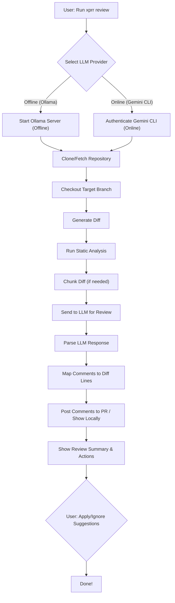
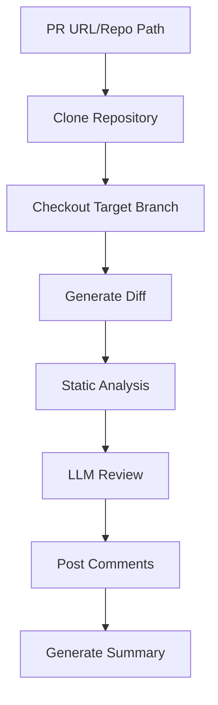

# 🚀 X-Pull-Request-Reviewer (Enterprise Edition)

**Enterprise-Grade, Hybrid LLM-Powered Code Review Agent**

Secure | Multi-Language | Hybrid (Offline + Online) | Plug-and-Play

---

## 🗺️ Agent Flow Overview



## ⚡ Quick Start (v0.0.1-beta)

1. **Download and extract the offline package:**
   ```bash
   gsutil cp gs://x-agents/xprr-agent-macos-v0.0.1-beta.tar.gz .
   tar -xzf xprr-agent-macos-v0.0.1-beta.tar.gz
   cd xprr-agent-macos-v0.0.1-beta
   ```
2. **Run the installer:**
   ```bash
   ./install-offline.sh
   ```
3. **Activate the Python environment:**
   ```bash
   source venv/bin/activate
   ```
4. **Authenticate Gemini CLI (if using online LLM):**
   ```bash
   ./xprr setup-gemini
   # Or manually set GEMINI_API_KEY or GOOGLE_CLOUD_PROJECT
   ```
5. **Review a pull request:**
   ```bash
   ./xprr review <PR_URL>
   # For offline review:
   ./xprr review <PR_URL> --provider ollama
   # With custom filter mode and context lines:
   ./xprr review <PR_URL> --filter-mode diff_context --context-lines 5
   ```

---

## 🎯 Core Features

### **🤖 Multi-LLM Provider Support (Hybrid Architecture)**
- **Ollama (Offline)**: Local models for air-gapped environments
  - **Primary Model**: `codellama-trained-20250624_193347` (3.6GB, fine-tuned for code review)
  - **Fallback Model**: `deepseek-coder-6.7b` (3.6GB, general code analysis)
  - **Context Window**: ~4,000 characters (optimized for code diffs)
  - **No Internet Required**: Complete offline operation
- **Gemini CLI (Online)**: Google's Gemini model via CLI interface (API key required)
  - **Model**: Gemini 1.5 Flash (latest)
  - **Context Window**: 1M+ tokens (handles large diffs)
  - **Internet Required**: API calls to Google's servers
- **Google Code Assist (Online)**: Enterprise-grade code analysis API
  - **Model**: Gemini 1.5 Flash (enterprise version)
  - **Context Window**: 1M+ tokens
  - **Internet Required**: Google Cloud API calls
- **Unified Interface**: Seamless switching between providers

### **🌍 Multi-Language Support**
- **Python**: Black formatting, flake8 linting
- **Java**: Google Java Format, Checkstyle
- **Go**: gofmt, golint
- **Terraform**: terraform fmt, tflint
- **YAML**: yamllint, prettier formatting
- **Shell**: shfmt, shellcheck security analysis

### **🔍 Static Analysis & Linting**
The agent performs comprehensive static analysis using language-specific tools:

```bash
# Python Analysis
black --check directory/     # Code formatting
flake8 directory/           # Linting and style

# Java Analysis  
google-java-format --check  # Code formatting
checkstyle -c config.xml    # Style and best practices

# Go Analysis
gofmt -l .                  # Code formatting
golint ./...                # Linting

# Terraform Analysis
terraform fmt -check        # Code formatting
tflint --chdir .           # Linting and validation

# YAML Analysis
yamllint file.yaml         # YAML validation
prettier --check file.yaml # Formatting

# Shell Analysis
shfmt -d file.sh           # Code formatting
shellcheck file.sh         # Security and best practices
```

### **🤖 LLM-Powered Review**
- **Line-by-Line Comments**: Detailed feedback on specific code lines
- **Review Summaries**: Overall assessment and priority actions
- **Structured Output**: Consistent format for actionable feedback
- **Chunked Processing**: Intelligent handling of large diffs

### **🔧 Interactive Change Management**
- **Change Selection**: Users can select which suggestions to apply
- **Batch Operations**: Apply all or specific changes
- **Change Reversion**: Ability to revert applied changes
- **Real-time Feedback**: Immediate confirmation of changes

## 🔧 How It Works

### **1. Repository Analysis Process**



### **2. Static Analysis Pipeline**

The agent performs comprehensive static analysis using language-specific tools:

```bash
# Python Analysis
black --check directory/     # Code formatting
flake8 directory/           # Linting and style

# Java Analysis  
google-java-format --check  # Code formatting
checkstyle -c config.xml    # Style and best practices

# Go Analysis
gofmt -l .                  # Code formatting
golint ./...                # Linting

# Terraform Analysis
terraform fmt -check        # Code formatting
tflint --chdir .           # Linting and validation

# YAML Analysis
yamllint file.yaml         # YAML validation
prettier --check file.yaml # Formatting

# Shell Analysis
shfmt -d file.sh           # Code formatting
shellcheck file.sh         # Security and best practices
```

### **3. LLM-Powered Review Process**

The agent uses advanced LLM prompting for intelligent code review:

```python
# Structured prompt for consistent reviews
structured_prompt = f"""
You are an expert security code reviewer. Analyze the following code changes and provide specific, actionable feedback.

REQUIRED OUTPUT FORMAT:
LINE <line_number> COMMENT: <specific issue and how to fix it>
SUMMARY: <overall assessment and priority actions>

RULES:
1. For each security issue, vulnerability, or best practice violation, use LINE <number> COMMENT: format
2. Include the actual line number from the diff where the issue occurs
3. Provide specific, actionable advice on how to fix each issue
4. Focus on security vulnerabilities, compliance issues, and best practices
5. Be specific about what's wrong and how to fix it

DIFF TO REVIEW:
{diff}

STATIC ANALYSIS:
{static_analysis_results}
"""
```

### **4. Chunked Processing for Large Diffs**

For large pull requests, the agent intelligently chunks the diff based on the LLM provider:

```python
# Ollama (Offline): Limited context window (~4,000 chars)
if provider == "ollama":
    max_chunk_chars = 4000  # Optimized for Ollama's context window
    chunked = chunk_diff_by_file_and_hunk(diff, max_chunk_chars=max_chunk_chars)

# Gemini CLI (Online): Large context window (1M+ tokens)
elif provider == "gemini_cli":
    # Process entire diff without chunking
    prompt = build_review_prompt(diff, static_summary_str, language)
    line_comments, summary_comment = query_llm_for_review(prompt, diff, provider="gemini_cli")

# Terraform: Special chunking by resource blocks
if language.lower() == "terraform":
    resource_blocks = re.split(r'\nresource\s+"', diff)
    # Process each resource block separately
```

### **5. Interactive Change Management**

Users can interactively apply suggested changes:

```bash
# Agent displays actionable suggestions
📝 ACTIONABLE CHANGES (3):
  [1] src/auth.py:15
      Reason: Hardcoded password detected
      Current: password = "secret123"
  
  [2] src/database.py:23
      Reason: SQL injection vulnerability
      Current: query = f"SELECT * FROM users WHERE id = {user_id}"

# User can select which changes to apply
Enter your choice: 1,3  # Apply changes 1 and 3
```

## 🔑 Authentication

- **Ollama (Offline):** No authentication required. All models are included for air-gapped use.
- **Gemini CLI (Online):**
  - **Google Cloud Project ID:**
    - Authenticate: `gemini auth login`
    - Set project: `export GOOGLE_CLOUD_PROJECT="YOUR_PROJECT_ID"`
  - **Gemini API Key:**
    - Get from [Google AI Studio](https://aistudio.google.com/app/apikey)
    - Set: `export GEMINI_API_KEY="YOUR_GEMINI_API_KEY"`
  - Use `./xprr setup-gemini` for interactive setup.

## 🌟 Why Gemini CLI is Great

### **🚀 Free Tier Benefits**
- **100 requests per day** using Gemini 2.5 Pro at no cost
- **No credit card required** for free tier usage
- **Perfect for testing and small teams** without upfront costs

### **💪 Advanced Features**
- **Model Control**: Choose between Gemini 1.5 Flash, 2.5 Pro, and other models
- **Higher Rate Limits**: Scale up with paid plans for enterprise usage
- **1M+ Token Context**: Handle large diffs without chunking
- **Real-time Processing**: Faster review times (15-30 seconds vs 30-45 seconds)
- **Enterprise Security**: Google's enterprise-grade security and compliance

### **🔧 Developer Experience**
- **Official CLI Tool**: First-party support from Google
- **Easy Authentication**: Simple API key or Google Cloud Project setup
- **Reliable Infrastructure**: Google's global infrastructure with 99.9%+ uptime
- **Future-Proof**: Access to latest model updates and features

### **📊 Cost Comparison**
| Feature | Ollama (Offline) | Gemini CLI (Online) |
|---------|------------------|---------------------|
| Setup Cost | Free | Free tier available |
| Daily Usage | Unlimited | 100 requests/day (free) |
| Model Updates | Manual | Automatic |
| Infrastructure | Self-hosted | Google Cloud |
| Context Window | ~4K chars | 1M+ tokens |

**Learn More**: [Gemini API Documentation](https://ai.google.dev/docs) | [Pricing Details](https://ai.google.dev/pricing)

## 🚀 Usage Examples

```bash
# Review a PR (auto-selects best LLM)
./xprr review https://github.com/org/repo/pull/123

# Force offline review
./xprr review <PR_URL> --provider ollama

# Review local repo
./xprr review --repo .

# Check agent status
./xprr status

# Setup Gemini CLI authentication
./xprr setup-gemini
```

## 🏢 Offline & Enterprise Deployment

- **Fully air-gapped:** All dependencies, models, and binaries included.
- **No internet required for Ollama mode.**
- **Gemini CLI and Google Code Assist supported for hybrid/cloud use.**
- **Install script checks and sets up everything automatically.**

**To deploy in an enterprise/air-gapped environment:**
1. Extract the package and run `./install-offline.sh`.
2. Use `./xprr review <PR_URL> --provider ollama` for offline reviews.
3. For online/hybrid, set up Gemini CLI as above.

## 🛠️ Troubleshooting & FAQ

- **Ollama model not found?** Run `./xprr setup` or check `ollama_models/`.
- **Gemini CLI auth issues?** Use `./xprr setup-gemini` and check your API key/project.
- **Permission denied?** Run `chmod +x xprr`.
- **No comments posted?** Ensure `GITHUB_TOKEN` is set for GitHub PRs.
- **Slow on large PRs?** Ollama chunks diffs; Gemini CLI handles large diffs natively.

For more, see the `docs/` folder or [GitHub Issues](https://github.com/inderanz/x-pull-request-reviewer/issues).

## 📂 Directory Structure (Key Components)

```
x-pull-request-reviewer/
├── src/           # Source code (agent, adapters, llm, review, github)
├── config/        # Configuration files
├── scripts/       # Helper scripts
├── ollama_models/ # Ollama model binaries
├── packages/      # Python wheels
├── tests/         # Test suite
├── docs/          # Additional documentation
├── xprr           # Main CLI entrypoint
├── install-offline.sh # Offline installer
└── README.md      # This file
```

## 📄 License

MIT License. See [LICENSE](LICENSE).

## 🆕 What's New in v0.0.1-beta

- **Filter Modes for Line Comments:**  
  Use `--filter-mode` to control where comments are posted:
  | Mode         | Description                                      |
  |--------------|--------------------------------------------------|
  | added        | (Default) Only on added lines in the diff        |
  | diff_context | Also on lines near the diff (±N lines)           |
  | file         | Anywhere in changed files                        |
  | nofilter     | Anywhere in the repo (least strict)              |

- **Multi-line Comment Support:**  
  The agent can post comments spanning multiple lines if the LLM provides a range.

- **Robust Line Mapping:**  
  Comments are only posted to valid, added lines in the latest commit, preventing GitHub API errors.

- **Enhanced Error Handling:**  
  Improved logging and fallback to general PR comments if line mapping fails.

---

**Happy reviewing! 🚀** 